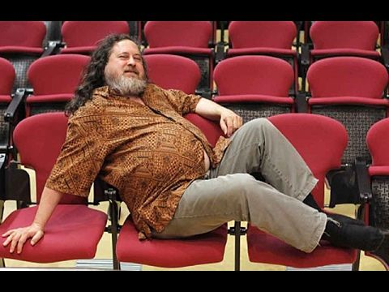
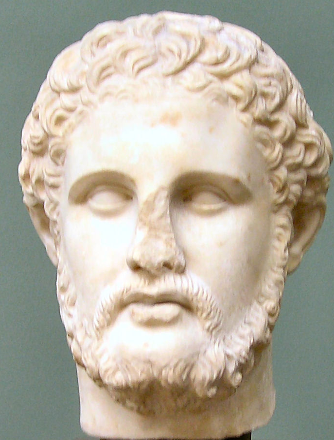
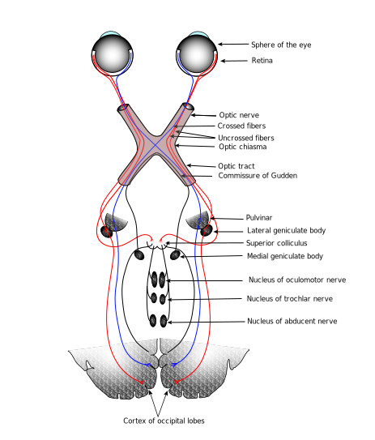

# Part I: Universal Truths & Cycles


This first part will cover some basic things that can apply to statistics, programming, and possibly well beyond.  None of the following really requires any specific background or experience to understand and begin implementing. 

## Face the facts and accept them

You have chosen to get, or have obtained, an advanced degree in a discipline that requires scientific output.  Among many things, science involves putting a theory into a mathematical form that allows for some form of analytical chicanery to be applied, in an effort to weigh evidence, in the form of data, for or against that theory.  This can be very simple, and it doesn't require causal formulation.  For example, the following:

$$Y = f(X) + \epsilon$$
may just mean something like life satisfaction ($Y$) is related to some set of other things like health, education, income, (i.e. all the stuff in $X$), but not exactly ($\epsilon$).

How you choose to investigate your theories will depend on your discipline, for better or worse. Practically speaking, it means you will have to do things like statistical analysis, collect data, do some programming, perhaps engage in a lot of writing, etc.  If this isn't for you, that's perfectly fine, it means you're *normal*, or at least among the vast majority of humanity.  And if it isn't your bag, it would be nice if you didn't waste the time and resources of faculty, students, and others who do want to engage in those activities, not to mention taxpayer money that's used to fund such pursuits.  Seriously, don't be a jerk.


One more thing to plan on - everything, I mean *everything*, will take longer than you expect.  That may even include your time-in-training.  You may, for example, plan on 4-5 years for a Ph.D., or, as faculty, 1 year to complete data collection and submit an article, but, as the old saying goes, shit happens.  You'll have to learn to deal with it.


## Get Organized


<br>

The movies would like you to believe that science is just a series of eureka moments had by oddball geniuses who can't seem to do anything right most of the time, but will intuit the perfect solution to any problem with just a moment's reflection.  As anyone who's actually engaged in scientific research knows, this is a bunch of BS.  On the contrary, if you're doing good science it's going to take a lot of hard work.  However, a few simple steps can be taken that will avoid a lot of wasted time.  There are a few things you can control in your research efforts, and being organized is one of them, so do it.

For starters, a very simple way to get organized is to create a project folder.  Many IDEs (e.g. Spyder for Python, RStudio for R) seem to do this now, which makes it easy.  But for any project you have, make a project folder that will be the home for what you're working on, e.g. a specific article or dissertation. This will serve as the working directory for that project[^setwd].  

In addition, it should have some organization to it, e.g. sub-folders for data, code, documents etc.  There are even R packages that [do this for you](http://projecttemplate.net/), but I advise against using someone else's organization, as it likely will not work for you[^folderstr].  Note  that your first attempt at this sort of organization will also probably not work, but that's okay, you'll eventually find one that does the trick for most of your projects.

As an example, I have a batch script that will create something similar to the following folder structure:

```proj_example
Project/
  Data_Files/
    raw/
    other/
  Code/
    Analysis/
    Data_Preparation/
    Descriptives/
    Functions/
    Related_Docs/
  Misc_Notes_Etc/
```

    
Very simple and straightforward. Also, note the underscores rather than spaces.  We'll talk about naming conventions later, but the gist is that you never want to name any file or folder with a space. People tell me it's `r year(today())` as I write this, but somehow spaces will still screw things up sometimes, or simply must be converted to something else at some point.

On the programming side, the other nice thing about projects is that whenever you open or switch to a project, all your scripts will be there just as you left them.  This allows you to pick things up right where you left off.  Little efficiencies gained just by being even slightly more organized can save weeks over the course of say, a dissertation.  Other things we will cover, e.g. doing things in a reproducible fashion, moving from simpler things to more complex, compartmentalization, version control, etc. are all little steps in organization that go a long way towards efficiency.


## Open and free is the way to be


<br>

The  researchers in the academic world who have kept up with the times generally are not using things like SPSS, MS Excel and MS Word to do their work.  They are also publishing in open outlets that allow for rapid dissemination and easy access to their work, and some are even [boycotting traditional outlets](https://en.wikipedia.org/wiki/Elsevier#Boycotts) altogether. Even if their primary tools are proprietary, such tools are using something open and/or free under the hood.  In fact, many of the most common tools of the trade are open source and/or freely available, e.g. C++, Python, R, $\LaTeX$, Markdown, etc.

At least one reason for this is because open source means the code is available to be inspected, the licenses for the code, if they apply, are far less restrictive[^license], and often anyone could potentially contribute to the development process.  This in turn produces more rapid development and extension. Furthermore, not everywhere in the world where people might want to do science is financially well off enough to throw thousands of dollars at software that doesn't do anything special.  This is why R, Python and similar rapidly gained and took over ground after years of dominance by SAS, SPSS, and similar[^freesas].

On the proprietary side, take for example, <span class="pack">Mplus</span>, a widely used software for structural equation modeling. At the time I started writing this, they just released version 8, five years after version 7 and a year and a half since the last point release (7.4).  This in and of itself is no big deal, given that the new features are few.  However, one of the things they mentioned were 'corrections to minor problems that have been found'.  They don't mention what the bugs were, but evidently they were allowed to exist at least for over a year, and we don't know if they existed prior to that as well.  

Other statistical software, like SPSS, have a 'full release' every year, but one would be hard pressed to know what's changed over the past 10. Nonetheless, they expect you and or your organization to pay for it each and every year. This sort of approach to software development in science is not acceptable in this day and age, especially when comparable or even better tools are available to do the same task[^propsoft]. 

Before I go on a rant, practically speaking, the best statistical, data science, and related tools currently are found with R and Python. For writing, it's far easier to use Rmarkdown for scientific publishing (*even if you use Python*, but feel free to try Jupyter), and if you really must have MS Word, it will generate a `.docx` document for you.  Otherwise, $\LaTeX$ is still quite commonly used and will produce a much better document than MS Word, especially if using mathematical formulas, tables, graphics etc.

I'm not saying you have to go as far as Richard Stallman, the guy pictured, who *only* uses free, as in both beer and speech, software.  But you have already long used and benefited from open source software, so all I'm saying is to continue doing so in your own research. 


## Compartmentalization


<br>

Now for a lesson from computer science, though more generally, it can be taken simply as <span class="emph">divide and conquer</span>.  Break your activities into smaller, more manageable chunks.  This makes it easy to pick up where you left off, and get things accomplished even if you don't have a lot of time.  It has the added benefit that when things go wrong, it's much easier to isolate the problem, and probably keep working on the other aspects of the project that are still functional.

### Analysis

For analysis, break activities into something like the following:

- Initial import and inspection: This is just making sure you're reading the data in correctly, and that a quick glance to see that it looks like it should. Maybe you'll do some filtering to get rid of things you know you'll not need.
- Data processing: This is all the stuff you should be doing before you ever look at even a mean or standard deviation. Calculating composites, data debugging, merging, etc. would be included.
- Descriptive analysis: This includes just getting a feel for the data via simple summaries, but you will likely find some data bugs you missed previously.
- Analysis: This will include things like trimming the data just to those variables necessary for the models, as well as running the models themselves. You may yet still find data bugs at this stage.
- Visualization: This can be quite an undertaking itself, even to just get one visualization just right.

Note that everything after the first step may not be a sequential process, and that's okay.

### Programming

Your code can generally follow the plan you had for analysis, but it can easily be even further compartmentalized.  For example, scripts can be specific to one goal, however trivial.  In the analysis stage, you might be investigating several outcomes of interest.  In that case, have a script specific to each one.

One might think that having a lot of scripts would be a problem, but generally, and if you're just starting out, the converse will be far more of an issue.  You can always create a master file that will call the scripts in a desired order. I have a not-so-hard-and-fast rule of thumb that if I get to 100 lines, I should have some justification for not breaking some of it out into a more manageable chunk[^notsoftware].  

This will also apply to functions for those that get further into programming.  Having one massive function that does everything is a PITA to debug, or have users inspect.  Having smaller functions allows one to isolate problems and make for more rapid debugging.

### Other

The idea of compartmentalization applies to other endeavors as well. For example, when writing your paper, give each section its own document (child) to be called by the parent document or at compilation.  This is easily done with tools like $\LaTeX$ and Rmarkdown. As a specific example, my [document introducing Bayesian analysis](http://m-clark.github.io/docs/bayesian_book/) has separate a separate Rmarkdown (`.Rmd`) file for each major section.

## Reproducibility

<br>
<br>

Assume that at some point you'll have to leave your analysis, code, document etc. behind. Perhaps another project comes to forefront, maybe it's just time off, maybe it's a health issue, who knows?  But think about when you come back and have to complete your mission.  Will you know what you've done?

This is only the beginning, but if you can't reproduce your own work it's certain no one else will. As a beginning framework, could someone take the data and your code and get the same results?  You'd be surprised at how much published work would fail what should be a simple test.

Some concepts you'll want some sense of include the following:

- <span class="emph">Reproducible research</span>
- <span class="emph">Replicability</span>
- <span class="emph">Literate statistical programming</span>
- <span class="emph">Dynamic Report Generation</span>
- <span class="emph">Article pre-registration</span>

and others. The differences in terminology regard the focus: analysis results, code, data archiving, report generation and so forth.  Exact replication is the one thing that, no matter how hard we might try, simply can't happen. Different times, different people involved, etc. all work against that being possible. However, we can get close, or define it in some acceptable way that can be done.

Practically speaking, just thinking about this topic will likely make you take steps to do better than what you might have otherwise.  But one can start by just thinking about yourself, could ***you*** do it, ***again***?


## Get a book


<br>

If you decide on a particular analytical route for your thesis, dissertation, or paper, get a book on the technique[^bookbycover], or at least one that covers the topic extensively. Buy it, check it out, whatever you need to, but have a handy reference for the thing you're about to spend an inordinate time on, possibly with not having ever dealt with it before.  It just makes sense.  Even if it's a little more technical, remember that you're about to spend a lot of time in this area, and that's the sort of thing you'll need.

The one thing you don't want to do is wing it based on what other applied researchers in your field are doing in the articles you're reading.  They may very well know what they're doing, but *you* may not have the skill set to distinguish that.  You can train a dog to bark when p < .05.


## Complexify later


<br>


A very old approach that has withstood the test of time in many domains- start with the simple, and build in complexity as you go[^complexify].  Even then, elegance and parsimony should be the goal, not complexity.

### Analysis

This really comes into play with analysis- *always* start with simpler models.  I personally use some of the simplest models for debugging purposes, because some data issues are difficult to discover until the implementation of analysis.  But even before modeling, you should be doing basic data checks and descriptives.  

The following provides an example where the final model is a mixed model with some other complexities added.

- Basic data descriptives. Know the range for numeric variables, and general frequency distribution for categorical, of all the variables going into your model.  Mean center or scale numeric variables. Possibly collapse very infrequent categories (if there is an issue).
- Run a regression. Check some diagnostics.
- Run a standard mixed model with just random intercepts.
- Run a standard mixed model with random slopes added.  Decide whether the complexity is warranted.
- Add interaction/nonlinear terms.

Taking the above approach allows one to feel more comfortable when they get to the more complex stage, and confident that the effects they see are actually reflective of what the data is attempting to express.

### Programming

In programming, this probably is best illustrated when writing functions.  Your first iteration of a function probably will only have a one or two arguments.  However, once you lay the (solid) foundation, you can build upon it later.  This suggestion has roots in the Knuth quote:

> Premature optimization is the root of all evil

It's okay to write some code that simply works, and add details and generalizations later.  You'll often be on some completely arbitrary time crunch, so the main thing is to write good code at the beginning, then work on making it more optimal or handle more complex situations later. 


## Much of your brain is devoted to visual processing


<br>

First, assume others' brains are not so different from yours, then take advantage of it.  One of my pet peeves is when I hear the phrase '*I'm a visual learner*.'  *Really*? So you have a brain? *Everyone* with working eyeballs is a visual learner.  Some can learn via other means, e.g. text and sound, but that is secondary.

The gist is that you should always be thinking how to display the products of your research visually, possibly even interactively. Unfortunately you will find that some journals are still acting as if it's 1950, and that people only peruse articles via print.  If you can believe it, they actually will charge *extra* for color[^toolong].  Journals that still have the black and white, print first mindset in this day and age should be avoided at all costs, unless you don't like people reading your research.

With regard to interesting visualization, too many people I consult/work with have literally told me the equivalent of "All these Ph.D.s and M.D.s that read my article or see my presentation won't be able to understand it."  Utterly ridiculous.  Maybe you will need to work on explaining the visualization to make it easier to digest, but I can assure you that folks in academia, as well as those beyond, can handle it.  If they were that dumb, which I refuse to believe, why exactly would you care if they even read your article? Are you anxious to be cited by nincompoops?

Some other things to note:

- Visualization may be the most fun you'll have with your document, spend some time with it.
- Color matters, and if you're just picking ones you like, you're doing it wrong.
- Bar plots of any kind have limited utility at best. Pie charts and some others are just a form of bar chart.
- Most cartograms are about as useful as bar plots.
- If your map could be interpreted as reflecting little more than population, you should try something else, regardless of how cool it looks.
- Infographics have little if any role to play in an academic setting. Do not waste people's time.
- Try to convert your categorical information to quantitative so that you'll have more options to play with.

Use data visualizations from 1936 and the 1800s as inspiration[^noflo]:


## Embrace uncertainty but avoid relativism


<br>


A lot of people living today think their opinion is valid merely by having it. This is not true, no matter what their parents told them, nor what all politicians seem to believe. You do not fly to a destination thinking it would be just as viable to flap your arms or click your heels together.  You don't cross the street thinking that the theory that 'all cars will stop for you, just for you' is a viable one.  Try telling your neighbor that the clear sky at noon is chartreuse.  I'm sure they'll look at you funny.

I could go on, but even a moment of reflection suggests that every ounce of human behavior goes against the idea that all ideas are equally valid. Evidence not only matters, it is what we live by as a species, and what got us this far.  There are definitely areas where it is difficult to tell whether one theory is better than another, especially in interesting and new areas of research, but this does not mean the evidence is rubbish, nor that it may not be used to suggest one path over another.  Evidence often may even lean very strongly in one particular direction, so much that one would be hard-pressed to even try to suggest an alternative.  It may also be found decades later to be utterly false. That's okay too[^laudan]. That's just the way things are, and anyone that thinks otherwise will have a very difficult time in life.  Pretending things are certain just simply doesn't make them so.

Your theory, whatever you're researching, resides somewhere between completely false to mostly correct given current knowledge. Regardless, it is incomplete, and possibly grossly inaccurate in places, and without the progress of science we'll never know.  This is why, despite journal reviewers' comments, null results are not only useful, they are interesting in and of themselves, and as vital as any 'statistically significant' result. We need to know that a treatment doesn't work, that one social group is not terribly different than another on some matter, that temperatures in the 'x' range will result in a cascading series of events ultimately leading to the space craft tearing itself apart before it breaks atmosphere.

Things like interval estimates and prediction error give us a sense of how much work we have left to do. Rely on them heavily.  The goal of research is not to give a definitive answer, but to reduce uncertainty, and that reduction is usually from a whole lot to very slightly less so.  If you're not okay with the fuzzy, science is probably not for you.


## Flexibility


<br>

Empty your mind, be formless. Shapeless, like water. If you put water into a cup, it becomes the cup. You put water into a bottle and it becomes the bottle. You put it in a teapot, it becomes the teapot. Now, water can flow... or it can *crash*. Be water, my friend.
<br>
~ [Bruce Lee](https://www.youtube.com/watch?v=cJMwBwFj5nQ)

The author of the one-inch-punch algorithm should not be taken lightly for obvious reasons[^leevoice].  Things happen, and you will need to be able to roll with the punches of data collection, analysis, collaboration, life etc.  Assume that at some point, something in the research process will not go your way, and deal with it as best you can.  There is literally nothing else you can do.


## Back up


<br>

Everything.  You should never lose more than a day's work under the worst of circumstances, and if you're doing things even with the bare modicum of responsibility, you probably won't lose more than a few minutes[^impermanence].  Thankfully tools like Box, Dropbox, Google's Backup etc., though with their drawbacks, make it easy to always have that backup.  Sometimes, you may even want to go to a previous state for replicability purposes, or to fix a bug that found it's way through your system, and there are tools available to help with this as well, such as Git.


## Know the basics of how computers/OS work


<br>


If you're wondering about what specifically I might be referring to in this section, it may mean you don't know the basics of how computers work.  As a result, you may be wasting a tremendous amount of your own and very likely others' time.  Note that I'm not even remotely suggesting things that would be regarded as 'technical' by anyone besides a news reporter.

I'll provide a single example. Probably the biggest time sink I experience in consulting is a Mac user looking for a file.

Thankfully, your primary computer doesn't work like your phone (yet), so don't expect it to, or treat it as if it did (e.g. leaving dozens of applications running eating up all your resources).  If you're doing analysis on your machine you should know how many cores and how much RAM you have, and why that matters.  You should also be able to check what resources are available at a given time.

However, your computer may not have enough hardware to do sophisticated analysis with the data you are interested in, and so you may have have to work on other machines.  While this is getting much easier, and will be trivial in time, at this stage of things you may have to gain some technical know-how to use, for example, a computing cluster environment of some kind.  At some point everything will be cloud-based, and applied researchers can remain completely ignorant of basic aspects of computing, but we're not quite there yet.

Beyond hardware, you should know the basic structure of your operating system, what are and how to change defaults (e.g. where files are downloaded), some simple shortcuts to help navigation, how to install programs efficiently etc.  I have been in workshops where people did not know the difference between an installer and the actual program it was meant to install.  Just note that knowing this does not qualify you for being 'tech savvy'.


## Your work isn't that important

<br>

To put some things in perspective, say an article you publish is cited by 1000 unique researchers, which would be a hell of a lot in practically any discipline.  That suggests that at least `r format(round(1000/7.5e+09, 7))`% of the population of the world knows about it.  Congrats.  A couple billion more and you'll be on par with a YouTube video of a cat from three months ago that everyone's already forgotten about.

Don't forget to take some time every once in a while to do something else.  See some live music, get some exercise, go to a museum, get drunk, whatever you need to do to not think about this esoteric part of intellectual endeavor that in the end $99.\bar{9}\%$ of the world couldn't care less about.  The world will keep spinning I assure you.  By the same token, don't be a jerk to your collaborators or the people you need to do your work (e.g. IT, administrators, etc.). 'First author' is not equivalent to 'alone'.

## Magic


<br>

Research takes a lot of effort. It does *not* happen by magic.  If some aspect about your work seems magical to you, you can be sure that a reviewer, other researcher, conference attendee will ask you about it.  For applied researchers doing quantitative work, this means being able to say more than 'I clicked and this happened!', or throwing the grad student under the bus when pressed on something you don't know.


### Analysis

Assuming the data has been prepared, running a Bayesian quantile regression with a complicated random effects structure takes one line of code in R, same as a t-test.  For most applied researchers, the former would be magic, and that's okay, if they don't intend to use it.  Despite what many seem to think though, you simply cannot correctly interpret a magical result.  As mentioned previously, you can train a dog to bark when p < .05.  Likewise researchers can mimic language they see in journal articles, sufficiently passing off what seems to be knowledge of the techniques employed.  This is part of what has contributed to numerous issues, retractions, etc. currently on display in various disciplines.

The time will come when you'll need to move beyond the basic stats you were formally taught, and you'll have to teach yourself and/or get some help to learn these new techniques, or they will remain magic to you.  However, learning new things is part of the definition of being an academic (and human for that matter)[^new].  You don't necessarily have to be an expert, but saying something is statistically significant is not enough to demonstrate knowledge of a technique.  Be prepared to do some work.


### Programming

In programming, sharing and reusing code is simply the way things are done. And that's a good thing.  However, if you're copying and pasting others' work and don't know what some parts of it are doing, or why it's written one way and not another, then that part of the code is indistinguishable from magic to you.  It may be that in order for that part to work properly, your data will need to be prepped a certain way.  It may also be that the code doesn't apply to your situation, and using it will produce problematic results. Magical code is also often behind errors that are uninterpretable to the researcher. As elsewhere, know what's going on in your research, and you'll avoid any number of problems.


## Summary of Part I


[^complexify]: Complexify is not a word, but I like it better than complicate.  Complexity may be good, not sure about complication.

[^folderstr]: Most of the folks I've come across that suggest ways to organize your directory typically call for a structure that would be notable overkill for applied researchers.  A lot of people could probably get away with just a couple folders.

[^setwd]: The first line of a programming script shouldn't have to be to set the working directory.

[^notsoftware]: This is not a rule that would apply e.g. in software development, but we're not talking about that... yet.

[^license]: Typically the restrictions are things like, cite the authors, and don't try to sell it.

[^freesas]: It's also the reason SAS and SPSS have integration with R and Python, and finally started offering free student versions.  Too little, way too late.

[^propsoft]: I honestly can't understand why almost [all of these proprietary statistical packages still exist](https://en.wikipedia.org/wiki/List_of_statistical_packages#Proprietary).  Some I know are still accepting payments even though development ended years ago.  Others served a need at one time that's long been met and surpassed by open source tools.  Some practically have zero presence outside of a particular discipline, but anyone brought up in that discipline may be unaware of that fact.

[^toolong]: They probably also have page limit restrictions.  Who will think of the printers?!!

[^bookbycover]: And you can judge them by their cover. One of the most useful books out there had some of the most sage advice ever written on its cover: *Don't Panic*.

[^laudan]: A useful text to peruse is @laudan2012science.

[^noflo]: Please don't actually do the Florence Nightengale type of plot, commonly referred to as wind rose plots.  While hers in particular is most beautiful, in the end they are glorified pie charts, and do a poor job of conveying what otherwise would be simple information to digest.

[^leevoice]: This document is written in alternating voices of the narrator of the Hitchhiker's Guide to the Galaxy and Bruce Lee in that clip.

[^impermanence]: I personally don't adhere to this as strongly as you should because I don't have deadlines/graduation looming, and I am fond of the Buddhist notion of impermanence.  I won't go so far as blowing my awesome sand mandala away as soon as I've created it, but I often don't mind starting over.

[^new]: I have actually heard the words come out of the mouth of one person as follows: "I'm faculty, I don't want to learn anything new!".  This person also never learned that he was a joke that no one, not even in his own department, took seriously, though many explicit hints had been provided that was the case.  There are people in academia that have a goal of getting tenure and doing the bare minimum from there on out.  They should be avoided at all costs.